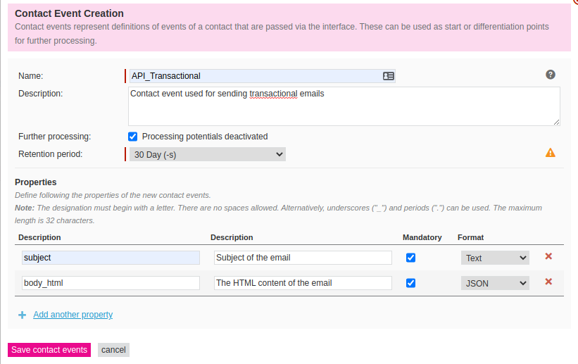
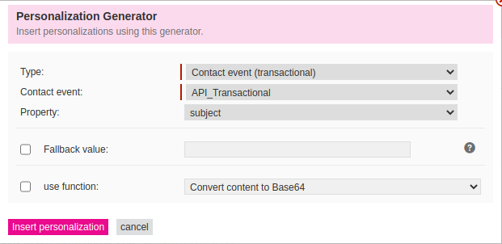
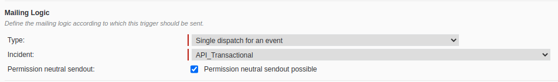

# Laravel Maileon
This package adds a custom mail driver for Maileon to Laravel.

Some configuration in the Maileon user interface is required.

## Requirements
* [laravel/laravel:^8.0](https://github.com/laravel/laravel)
* [bensampo/laravel-enum:^3.4](https://github.com/BenSampo/laravel-enum)
* [guzzlehttp/psr7:^1.8](https://github.com/guzzle/psr7)
* [php-http/discovery:^1.14](https://github.com/php-http/discovery)
* [psr/http-client:^1.0](https://github.com/php-fig/http-client)
* [psr/http-message:^1.0](https://github.com/php-fig/http-message)

## Installation

Install the package:
```shell
composer require dennis-koster/laravel-maileon
```

Publish the configuration file:
```shell
php artisan vendor:publish --provider="DennisKoster\\LaravelMaileon\\Providers\\LaravelMaileonServiceProvider"
```

Add the missing environment variables to your `.env` file:

```
MAILEON_API_URL=
MAILEON_API_KEY=
MAILEON_TRANSACTIONAL_CONTACT_EVENT=
```
## Configure Maileon
Maileon does not support sending transactional emails out of the box.
We need to take a couple of steps in the Maileon interface to set everything up.

### 1. Creating the contact event
After logging in, go to "Lists & Contacts" in the top menu.
Then click "Contact events" in the left menu, and the click the button "Create a new contact event".

Use the following settings:
```
Name: API_Transactional
Description: Contact event used for sending transactional emails
Further processing: Enabled
Retention period: 30 Days
```

Then create these two fields:

```
Name: subject
Description: Subject of the email
Mandatory: Yes
Format: Text
```
```
Name: body_html
Description: The HTML content of the email
Mandatory: Yes
Format: JSON (!! Very important and counter-intuitive)
```



### 2. Setting up the trigger
Click Mailings in the top menu, and then navigate to "Trigger drafts" in the left menu.
Then click the `[new trigger draft]` button.

Choose the "New content editor" option when prompted.

Enter a name that's easily recognizable like "Transactional mail"

For the subject, click the blue `[.]` icon to the right side of the input field.
Select the type `Contact event (transactional)`.
Then select the Contact event we just created (`API_Transactional`) and select the property `subject`.
Finally, press the `[Insert personalization]` button.



Enter your sender details and then click the blue `Continue` button in the right bottom corner.

Choose the "From scratch option".

When presented with the drag and drop editor, click the `[Drag & drop editor]` button on the bottom left of the screen, and select `Code editor`.

Remove all contents in the code editor and replace it with the following:
```shell
[[TRANSACTION|"body_html[0]"]]
```

Then click the `[Save]` button in the top right corner, followed by the `X Close` button.

Click the blue `Contine` button again in the bottom right corner of the screen, to go to the `Dispatch logic & Approval` screen.

For the `Mailing logic` type, select `Single dispatch for an event` and then for incident, select the trigger we created (`API_Transactional`).

Enable `Permission neutral sendout`.



Finally, click the `[activate Trigger-mailing]` button in the bottom right corner.
